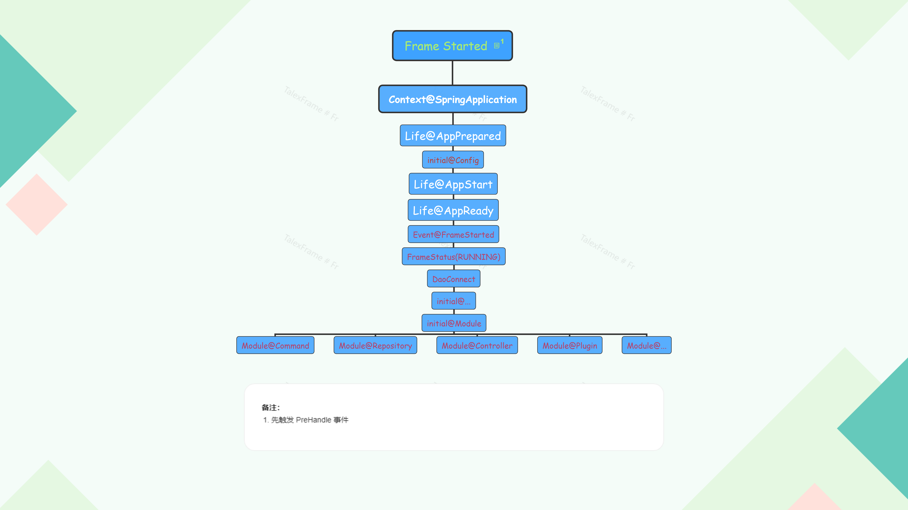

# TalexFrame # 架构

### 7.0.0 全新架构 

> 7.0.0 架构遵循 分离，模块，功能，同步 四大原则

## 分离

将整个框架分离出来，例如 Launcher、Frame、Checker 分别代表三个大块

### Launcher

> Launcher 是框架的启动器

Launcher 在启动的时候会进行 环境检测、初次运行检测、目录优化 等

整个 Launcher 的生命周期：

​	开始 -> 环境检测 -> 初次运行检测 -> 目录优化 -> 分配框架 -> 结束

**其中分配框架即 Launcher 的结束转而 Frame 的启动**

### Frame

> Frame 是框架的框架

Frame 即框架中的核心，提供框架的核心实现与核心功能

整个 Frame 的生命周期：

​	

### Checker

> Checker 即框架审查器，提供系统的监测，性能的分析等

当 Frame 完整启动后就会启动 Checker